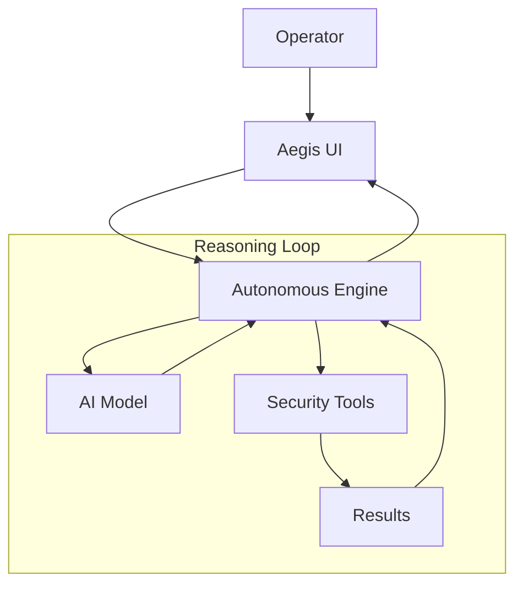

# 🛡️ Aegis Security Console

[](https://www.python.org/)
[](https://ai.google.dev/)
[](https://opensource.org/licenses/MIT)

> **Autonomous Digital Security Auditor** — A highly autonomous, cyberpunk-themed security agent that utilizes the ReAct framework to scan, map, and audit web applications for vulnerabilities.

---

## 🌌 Core Features

- **Autonomous ReAct Engine**: Powered by Mistral & Gemini, the agent reasons through complex security workflows independently.
- **Dynamic Fallback AI**: Automatic failover between providers ensuring uninterrupted security audits.
- **Void-Dark GUI**: A hardware-accelerated interface with neon accents and parallax effects.
- **Zero-Install Binary**: Compiled into a single, standalone Windows `.exe`.
- **Encrypted Local Config**: Security credentials and API keys are stored locally in a secure format.

---

## 🏗️ Architecture



---

## 📂 Project Structure

- `ui.py`: Graphical User Interface
- `main.py`: Core ReAct loop
- `ai_engine.py`: AI Provider manager
- `tools.py`: Security tool suite
- `run_aegis.py`: Compilation bootloader

---

## 🚀 Getting Started

### **Method 1: Standalone Binary (Recommended)**
1. Navigate to `dist/`.
2. Launch `Aegis_Security_Console.exe`.
3. Configure API keys and start the audit.

### **Method 2: Source Installation**
```bash
git clone https://github.com/pisum-sativum/aegis-security-console.git
cd aegis-security-console
pip install requests pyinstaller
python ui.py
```

---

## 🛠️ Build & Compilation

```bash
python -m PyInstaller --noconsole --onefile --name "Aegis_Security_Console" run_aegis.py --clean -y
```

---

## 🔒 Security & Privacy Warning
Aegis-Agent is an active security auditing tool. DO NOT target systems without explicit authorization.

---

Developed with 🛡️ for a Secure Digital Frontier.
