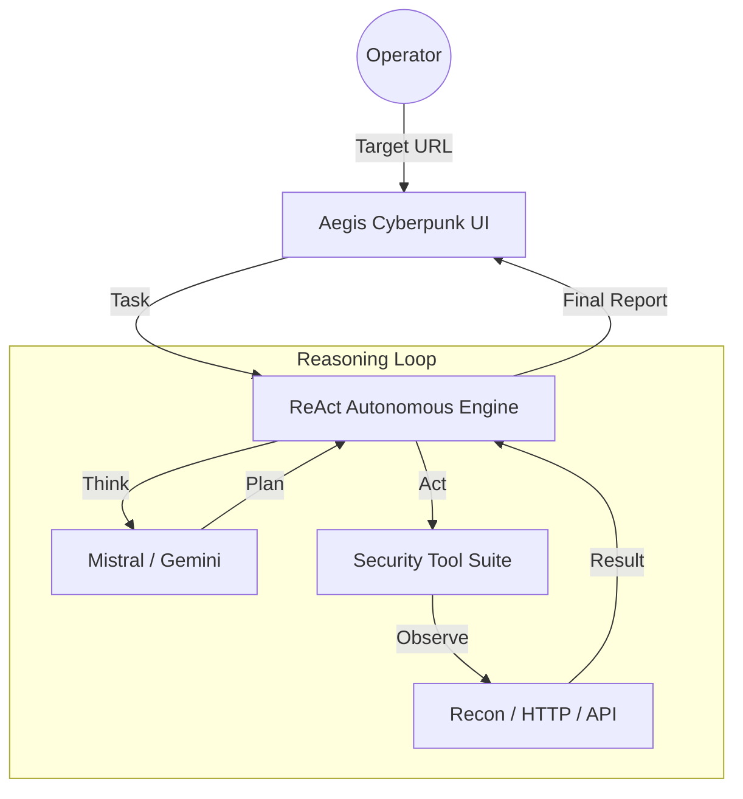

# 🛡️ Aegis Security Console

[](https://www.python.org/)
[](https://ai.google.dev/)
[](https://github.com/pisum-sativum/aegis-security-console)
[](https://opensource.org/licenses/MIT)

> **Autonomous Digital Security Auditor** — A highly autonomous, cyberpunk-themed security agent that utilizes the ReAct framework to scan, map, and audit web applications for vulnerabilities.

---

## 🌌 Core Features

| Feature | Description |
| :--- | :--- |
| **Autonomous ReAct Engine** | Powered by Mistral & Gemini, the agent reasons through complex security workflows independently. |
| **Dynamic Fallback AI** | Automatic failover between providers ensuring uninterrupted security audits. |
| **Void-Dark GUI** | A hardware-accelerated interface with neon accents, parallax effects, and particle trails. |
| **Zero-Install Binary** | Compiled into a single, standalone Windows `.exe`. No environment setup required. |
| **Encrypted Local Config** | Security credentials and API keys are stored locally in a hidden, secure JSON format. |

---

## 🏗️ Architecture



---

## 📂 Project Structure

```text
aegis_project/
├── ui.py               # The main Graphical User Interface (Cyberpunk Theme)
├── main.py             # The core ReAct loop that controls the autonomous agent
├── ai_engine.py        # AI Provider connection and authentication manager
├── tools.py            # Security suite: Network Recon, API Parser, HTTP Client
└── run_aegis.py        # Master Bootloader for compilation
```

---

## 🚀 Getting Started

### **Method 1: Standalone Binary (Recommended)**
1. Navigate to the `dist/` directory.
2. Launch `Aegis_Security_Console.exe`.
3. Configure your API keys in the **Configuration** tab.
4. Input your target and initiate the **Autonomous Audit**.

### **Method 2: Source Installation**
```bash
# Clone the repository
git clone https://github.com/pisum-sativum/aegis-security-console.git
cd aegis-security-console

# Install dependencies
pip install requests pyinstaller

# Launch the console
python ui.py
```

---

## 🛠️ Build & Compilation

To recompile the standalone executable after making code changes:
```bash
python -m PyInstaller --noconsole --onefile --name "Aegis_Security_Console" run_aegis.py --clean -y
```

---

## 🔒 Security & Privacy Warning
Aegis-Agent is an active security auditing tool. **DO NOT** target systems without explicit authorization. Unauthorized scanning is illegal and unethical.

---

Developed with 🛡️ for a Secure Digital Frontier.
